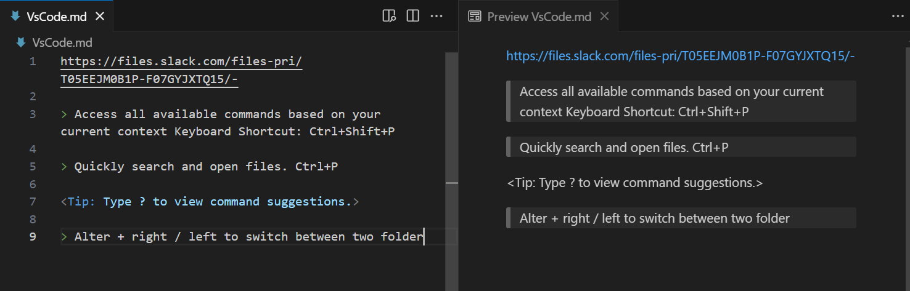
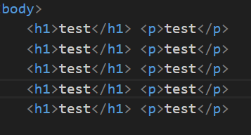
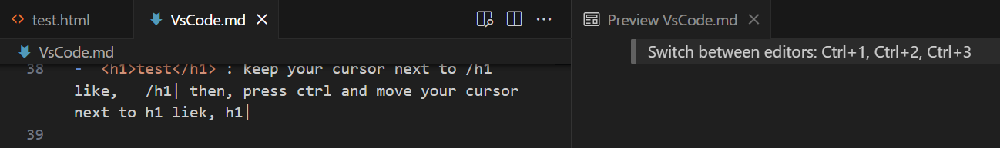
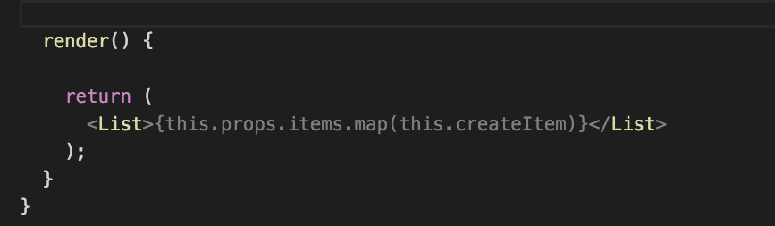
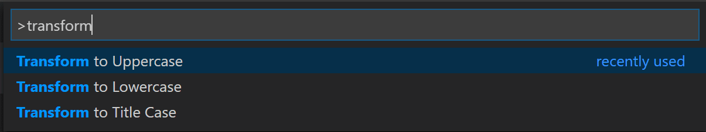

https://code.visualstudio.com/docs/getstarted/tips-and-tricks

> Access all available commands based on your current context Keyboard Shortcut: Ctrl+Shift+P

> Quickly search and open files. Ctrl+P

<Tip: Type ? to view command suggestions.>

> Alter + right / left to switch between two folder

> Navigate / Open between recently opened folders and workspaces : Ctrl+R

> Change language mode: Ctrl+K M

> Change your theme: Ctrl+K Ctrl+T
-   File > Preference > Theme Voila 🎉
-   ctrl+p > type "> file icon" > hit enter

> Toggle Sidebar: Ctrl + B

> Toggle Panel : Crtl + j / crtl + `

> Side by side editing:  Ctrl+\

>Switch between editors: Ctrl+1, Ctrl+2, Ctrl+3

> Close the currently opened folder: Ctrl+K F

> Navigation history
- Navigate entire history: Ctrl+Tab
- Navigate back: Alt+Left
- Navigate forward: Alt+Right

> Multi cursor selection
- `<h1>test</h1>`: keep your cursor next to /h1 like,   /h1| then, press ctrl and move your cursor next to h1 liek, h1|

- `<h1>test</h1>` //select "test" > Ctrl+Alt+Up or Ctrl+Alt+Down 
- `<h1>test</h1>` > edit, simple?!

- `Crtl + D`  // most useful

-  
- //simply `shift+alt` select p tag and grag down and delete it. //ABOVE image

> Copy line up / down: Shift+Alt+Up or Shift+Alt+Down

> Move line up and down: Alt+Up or Alt+Down

> `shift + alt + right / left` // test vdcode to right side 

> Go to Symbol in File: Ctrl+Shift+O
- You can group the symbols by kind by adding a colon, @:.

>Trim trailing whitespace
Keyboard Shortcut: Ctrl+K Ctrl+X

> Transform text commands : ctrl + p > 

> Code formatting
Currently selected source code: Ctrl+K Ctrl+F
Whole document format: Shift+Alt+F

> Select current line: Ctrl+L

> IntelliSense
Ctrl+Space to trigger the Suggestions widget.